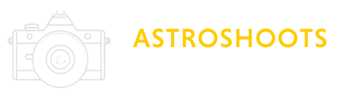

# Astro-Shoots

Astro-Shoots is a Flask-based project designed to calculate the optimal number of untracked photographs for capturing
deep space objects (DSOs). The application utilizes data from the [OpenNGC](https://github.com/mattiaverga/OpenNGC)
project through the [PyONGC](https://github.com/mattiaverga/pyongc) Python package and leverages
the [Astropy](https://www.astropy.org/) library for astronomical calculations, allowing users to select a DSO from a
comprehensive list.

> **Disclaimer**: _This project is an amateur effort created for learning purposes and recreational use only. It is not
intended for rigorous or scientific work. The author assumes no responsibility for the usage or interpretation of the
results._

## Features

- Select a DSO from the OpenNGC list
- Input your location or use browser location services
- Specify observation date and DSO elevation in degrees
- Choose your camera model or manually enter sensor details
- Customize shooting parameters, such as:
    - Aperture
    - Focal length
    - Camera position
    - Interval between shots

## Results

Upon submission, the application generates a table containing various technical data. The most important results
include:

- Maximum shooting speed without star trails
- Maximum number of shots without repositioning the camera

By providing these insights, Astro-Shoots helps photographers optimize their deep space photography sessions and capture
stunning images of celestial objects.
